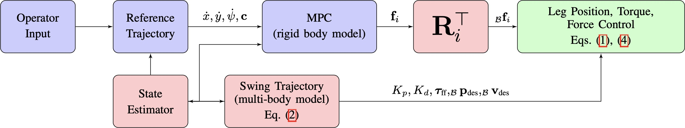
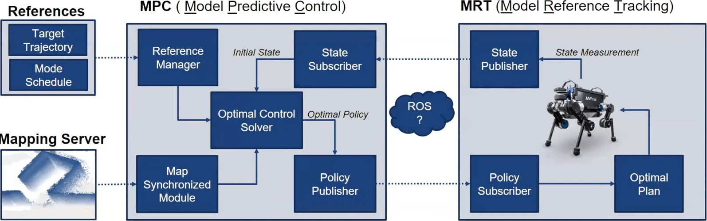
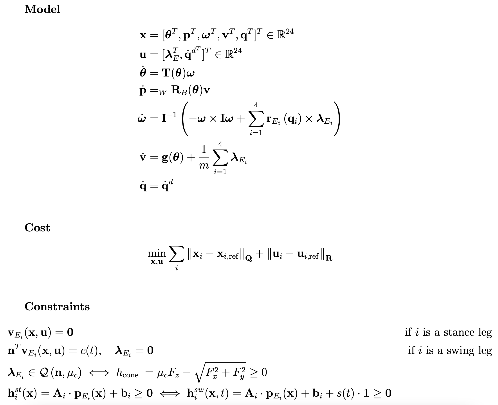
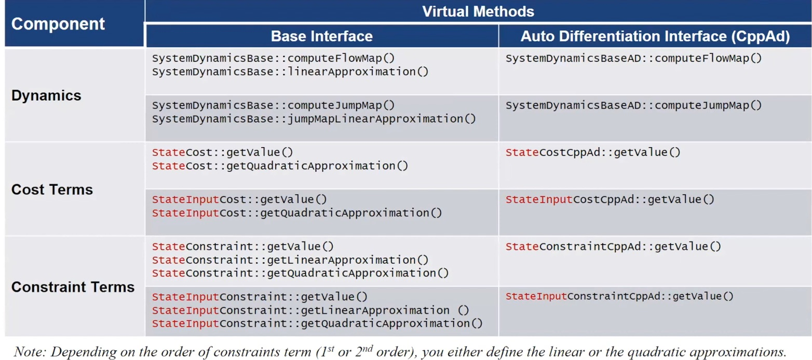
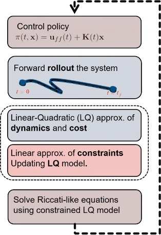
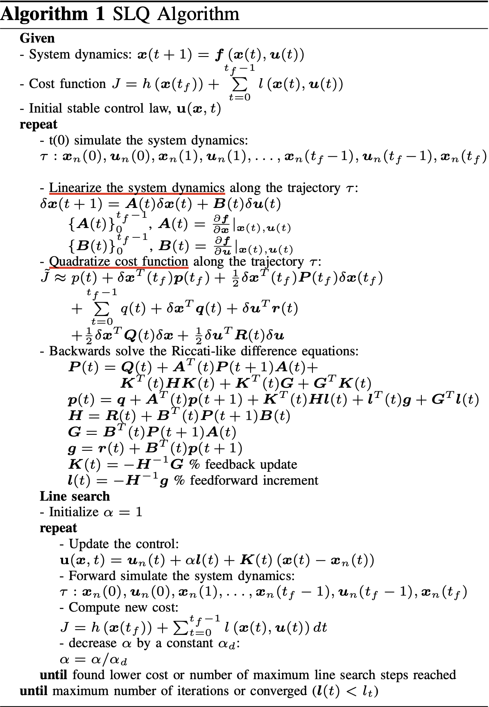
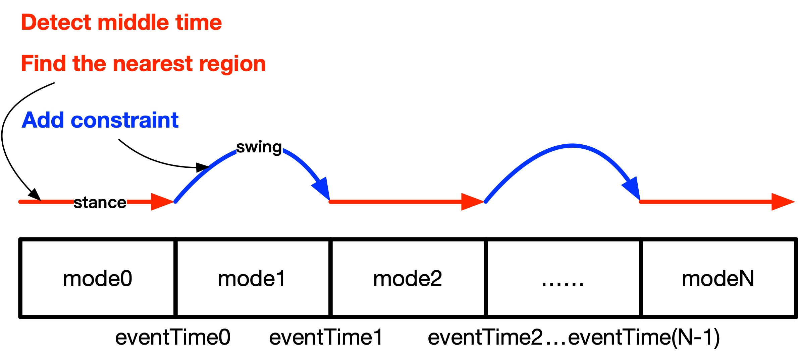
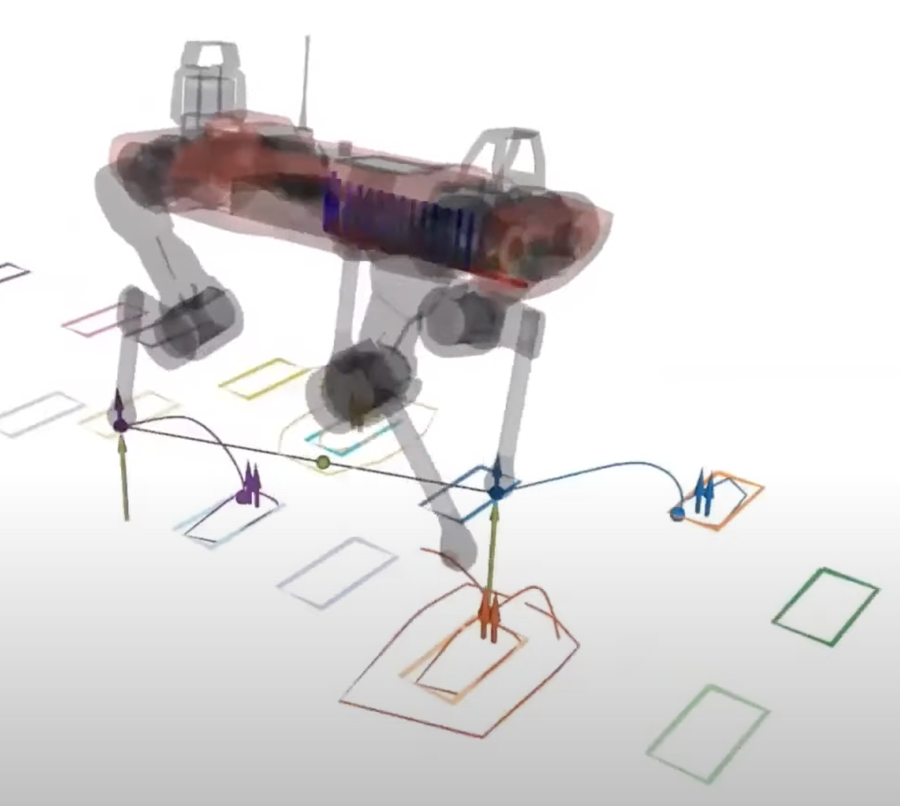
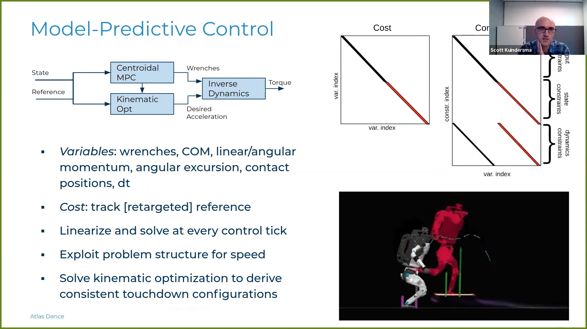

- [ocs2_legged_robot_annotated](#ocs2_legged_robot_annotated)
  - [MIT 控制框架](#mit-控制框架)
  - [ETH 控制框架](#eth-控制框架)
    - [ROS 节点图](#ros-节点图)
    - [Class List](#class-list)
  - [Formulation](#formulation)
    - [Implementation](#implementation)
      - [API](#api)
      - [Example](#example)
        - [代价 `LeggedRobotStateInputQuadraticCost`](#代价-leggedrobotstateinputquadraticcost)
        - [等式约束 `ZeroForceConstraint`](#等式约束-zeroforceconstraint)
        - [动力学模型 `LeggedRobotDynamicsAD`](#动力学模型-leggedrobotdynamicsad)
        - [`LeggedRobotPreComputation`](#leggedrobotprecomputation)
        - [`ReferenceManager` <- `SwitchedModelReferenceManager`](#referencemanager---switchedmodelreferencemanager)
        - [`SolverSynchronizedModule` <- `GaitReceiver`](#solversynchronizedmodule---gaitreceiver)
  - [Solver](#solver)
    - [算法](#算法)
    - [约束处理方法](#约束处理方法)
    - [实现细节](#实现细节)
  - [State-only Foot Placement Constraints [TODO]](#state-only-foot-placement-constraints-todo)
    - [Illustration](#illustration)
    - [执行顺序](#执行顺序)
    - [构造 LQ 问题](#构造-lq-问题)
  - [References](#references)

---

# ocs2_legged_robot_annotated

> 足式机器人的例子是一个开关系统问题。它实现了一个四足机器人Anymal运动控制的MPC方法。机器人的步态由用户定义，在执行过程中可以通过求解器的同步模块 (GaitReceiver) 进行修改。模式序列和目标轨迹是通过一个参考管理器模块 (SwitchedModelReferenceManager) 定义的。代价函数是一个二次罚函数，以跟踪机器人身体位置和偏航指令，并将机器人的重量平均分配到触地腿上。该问题有几个随模式变化的约束条件：摆动腿的地面作用力为零；触地腿的速度为零；摩擦锥约束；为避免足端和地面摩擦，摆动腿末端须跟踪一个预定的Z向运动。

> 系统动力学的建模有两种方式，可以从配置文件中选择。(1) 单一刚体动力学 (SRBD)，这个模型假设系统具有恒定的惯性，而不管其关节位置如何，它也包括了系统的全部运动学；(2) 全中心动力学 (FCD)。这个模型使用中心动力学，它包括了机器人四肢的运动，与 SRBD 类似，它考虑了机器人的全部运动学。


| 子文件夹            | 功能                      |
| :------------------ | :------------------------ |
| command             | 键盘控制                  |
| common              | 常用功能                  |
| constraint          | 约束类型                  |
| cost                | 代价类型                  |
| dynamics            | 动力学模型 (by Pinocchio) |
| foot_planner        | 摆动腿规划                |
| gait                | 步态设置                  |
| initialization      | 初始化                    |
| synchronized_module | 优化器参数同步            |
| visualization       | 可视化                    |

## MIT 控制框架



## ETH 控制框架



### ROS 节点图


### Class List

- `LeggedRobotModeSequenceKeyboard`: 检测用户指令更新步态改变 Switched Systems 的模式序列 (ModeSequence)
- `EndEffectorLinearConstraint`: 一阶足端位置/速度的线性约束
- `FrictionConeConstraint`: 二阶触地足端摩擦锥不等式约束
- `NormalVelocityConstraintCppAd`: 一阶摆动腿足端Z向速度(=摆动轨腿迹规划的Z向速度 LeggedRobotPreComputation::request)等式约束 (CppAd版)
- `ZeroForceConstraint`: 一阶摆动腿足端零地面反作用力等式约束
- `ZeroVelocityConstraintCppAd`: 一阶触地足端零速度等式约束 (CppAd版)
- `LeggedRobotStateInputQuadraticCost`: 状态与输入的二次代价
- `LeggedRobotDynamicsAD`: 动力学约束 (CppAd版)
- `CubicSpline`: 三次样条曲线
- `SplineCpg`: 摆动腿曲线 (CPG = Central Pattern Generator?)
- `SwingTrajectoryPlanner`: 摆动腿Z向高度规划
- `GaitReceiver`: 步态更新接收器 (A Solver synchronized module is updated once before and once after a problem is solved)
- `GaitSchedule`: 步态定义类
- `LeggedRobotInitializer`: 初始化类
- `SwitchedModelReferenceManager`: Manages the **ModeSchedule** and the **TargetTrajectories** for switched systems
- `LeggedRobotVisualizer`: 可视化类
- `LeggedRobotInterface`: MPC 实现接口
- `LeggedRobotPreComputation`: Request callback are called before getting the value or approximation

## Formulation

X = `[ linear_momentum / mass, angular_momentum / mass, base_position, base_orientation_zyx, joint_positions ]` 

U = `[ contact_forces, contact_wrenches, joint_velocities ]` 



### Implementation
#### API


1. 定义 `OptimalControlProblem`
   - 代价
   - 软约束/硬约束
   - 动力学模型
   - PreComputation
2. 定义 `ReferenceManagerInterface`
3. 定义 `SolverSynchronizedModule`

#### Example

##### 代价 `LeggedRobotStateInputQuadraticCost`

##### 等式约束 `ZeroForceConstraint`

##### 动力学模型 `LeggedRobotDynamicsAD`

##### `LeggedRobotPreComputation`

##### `ReferenceManager` <- `SwitchedModelReferenceManager`

##### `SolverSynchronizedModule` <- `GaitReceiver`

## Solver


### 算法


### 约束处理方法

| 约束类型             | 处理方法                                            |
| :------------------- | :-------------------------------------------------- |
| State-input 等式约束 | Lagrangian method/Projection technique              |
| State-only 等式约束  | Penalty method -> **Augmented Lagrangian**          |
| 不等式约束           | Relaxed barrier methods -> **Augmented Lagrangian** |

### 实现细节

核心 Class

- MPC_BASE <- **MPC_DDP**
- SolverBase <- **GaussNewtonDDP**

```c++
// FILE: GaussNewtonDDP.cpp
// Description: DDP main loop
while (!isConverged && (totalNumIterations_ - initIteration) < ddpSettings_.maxNumIterations_) {
  // display the iteration's input update norm (before caching the old nominals)
  if (ddpSettings_.displayInfo_) {
    std::cerr << "\n###################";
    std::cerr << "\n#### Iteration " << (totalNumIterations_ - initIteration);
    std::cerr << "\n###################\n";

    scalar_t maxDeltaUffNorm, maxDeltaUeeNorm;
    calculateControllerUpdateMaxNorm(maxDeltaUffNorm, maxDeltaUeeNorm);
    std::cerr << "max feedforward norm: " << maxDeltaUffNorm << "\n";
  }

  // cache the nominal trajectories before the new rollout (time, state, input, ...)
  swapDataToCache();
  performanceIndexHistory_.push_back(performanceIndex_);

  // run the an iteration of the DDP algorithm and update the member variables
  runIteration(unreliableControllerIncrement);

  // increment iteration counter
  totalNumIterations_++;

  // check convergence
  std::tie(isConverged, convergenceInfo) =
      searchStrategyPtr_->checkConvergence(unreliableControllerIncrement, performanceIndexHistory_.back(), performanceIndex_);
  unreliableControllerIncrement = false;
}  // end of while loop

// Description: Runs a single iteration of Gauss-Newton DDP
void GaussNewtonDDP::runIteration(bool unreliableControllerIncrement) {
  // disable Eigen multi-threading
  Eigen::setNbThreads(1);

  // finding the optimal stepLength
  searchStrategyTimer_.startTimer();
  // the controller which is designed solely based on operation trajectories possibly has invalid feedforward.
  // Therefore the expected cost/merit (calculated by the Riccati solution) is not reliable as well.
  scalar_t expectedCost = unreliableControllerIncrement ? performanceIndex_.merit : sTrajectoryStock_[initActivePartition_].front();
  runSearchStrategy(expectedCost);
  searchStrategyTimer_.endTimer();

  // update the constraint penalty coefficients
  updateConstraintPenalties(performanceIndex_.stateEqConstraintISE, performanceIndex_.stateEqFinalConstraintSSE,
                            performanceIndex_.stateInputEqConstraintISE);

  // linearizing the dynamics and quadratizing the cost function along nominal trajectories
  linearQuadraticApproximationTimer_.startTimer();
  approximateOptimalControlProblem();
  linearQuadraticApproximationTimer_.endTimer();

  // solve Riccati equations
  backwardPassTimer_.startTimer();
  avgTimeStepBP_ = solveSequentialRiccatiEquations(heuristics_.dfdxx, heuristics_.dfdx, heuristics_.f);
  backwardPassTimer_.endTimer();

  // calculate controller
  computeControllerTimer_.startTimer();
  // cache controller
  cachedControllersStock_.swap(nominalControllersStock_);
  // update nominal controller
  calculateController();
  computeControllerTimer_.endTimer();

  // display
  if (ddpSettings_.displayInfo_) {
    printRolloutInfo();
  }

  // TODO(mspieler): this is not exception safe
  // restore default Eigen thread number
  Eigen::setNbThreads(0);
}
```

## State-only Foot Placement Constraints [TODO]


> For each contact phase within the MPC horizon, the terrain segment is selected that is closest to the reference end-effector position determined by , evaluated at the middle of the stance phase.

### Illustration



```c++
void SwitchedModelReferenceManager::modifyReferences(
    scalar_t initTime, scalar_t finalTime, const vector_t& initState,
    TargetTrajectories& targetTrajectories, ModeSchedule& modeSchedule) {
  const auto timeHorizon = finalTime - initTime;
  modeSchedule = gaitSchedulePtr_->getModeSchedule(initTime - timeHorizon,
                                                   finalTime + timeHorizon);

  const scalar_t terrainHeight = 0.0;
  swingTrajectoryPtr_->update(modeSchedule, terrainHeight);
}
```



### 执行顺序

```c++
// SolverBase::run
void SolverBase::run(scalar_t initTime, const vector_t& initState, scalar_t finalTime, const scalar_array_t& partitioningTimes) {
  preRun(initTime, initState, finalTime);
  runImpl(initTime, initState, finalTime, partitioningTimes);
  postRun();
}
void SolverBase::run(scalar_t initTime, const vector_t& initState, scalar_t finalTime, const scalar_array_t& partitioningTimes,
                     const std::vector<ControllerBase*>& controllersPtrStock) {
  preRun(initTime, initState, finalTime);
  runImpl(initTime, initState, finalTime, partitioningTimes, controllersPtrStock);
  postRun();
}

// SolverBase::preRun
void SolverBase::preRun(scalar_t initTime, const vector_t& initState, scalar_t finalTime) {
  referenceManagerPtr_->preSolverRun(initTime, finalTime, initState);

  for (auto& module : synchronizedModules_) {
    module->preSolverRun(initTime, finalTime, initState, *referenceManagerPtr_);
  }
}

// ReferenceManager::preSolverRun
void ReferenceManager::preSolverRun(scalar_t initTime, scalar_t finalTime, const vector_t& initState) {
  targetTrajectories_.updateFromBuffer();
  modeSchedule_.updateFromBuffer();
  modifyReferences(initTime, finalTime, initState, targetTrajectories_.get(), modeSchedule_.get());
}
```

### 构造 LQ 问题

```c++
void LinearQuadraticApproximator::approximateLQProblem(const scalar_t& time, const vector_t& state, const vector_t& input,
                                                       ModelData& modelData) const {
  constexpr auto request = Request::Cost + Request::SoftConstraint + Request::Constraint + Request::Dynamics + Request::Approximation;
  problemPtr_->preComputationPtr->request(request, time, state, input);

  // dynamics
  approximateDynamics(time, state, input, modelData);

  // constraints
  approximateConstraints(time, state, input, modelData);

  // cost
  approximateCost(time, state, input, modelData);
}

void LinearQuadraticApproximator::approximateDynamics(const scalar_t& time, const vector_t& state, const vector_t& input,
                                                      ModelData& modelData) const {
  // get results
  modelData.dynamics_ = problemPtr_->dynamicsPtr->linearApproximation(time, state, input, *problemPtr_->preComputationPtr);
  modelData.dynamicsCovariance_ = problemPtr_->dynamicsPtr->dynamicsCovariance(time, state, input);

  // checking the numerical stability
  if (checkNumericalCharacteristics_) {
    std::string err = modelData.checkDynamicsDerivativsProperties();
    if (!err.empty()) {
      std::cerr << "what(): " << err << " at time " << time << " [sec]." << std::endl;
      std::cerr << "x: " << state.transpose() << '\n';
      std::cerr << "u: " << input.transpose() << '\n';
      std::cerr << "Am: \n" << modelData.dynamics_.dfdx << std::endl;
      std::cerr << "Bm: \n" << modelData.dynamics_.dfdu << std::endl;
      throw std::runtime_error(err);
    }
  }
}

void LinearQuadraticApproximator::approximateConstraints(const scalar_t& time, const vector_t& state, const vector_t& input,
                                                         ModelData& modelData) const {
  // State-input equality constraint
  modelData.stateInputEqConstr_ =
      problemPtr_->equalityConstraintPtr->getLinearApproximation(time, state, input, *problemPtr_->preComputationPtr);
  if (modelData.stateInputEqConstr_.f.rows() > input.rows()) {
    throw std::runtime_error("Number of active state-input equality constraints should be less-equal to the input dimension.");
  }

  // State-only equality constraint
  modelData.stateEqConstr_ = problemPtr_->stateEqualityConstraintPtr->getLinearApproximation(time, state, *problemPtr_->preComputationPtr);
  if (modelData.stateEqConstr_.f.rows() > input.rows()) {
    throw std::runtime_error("Number of active state-only equality constraints should be less-equal to the input dimension.");
  }

  // Inequality constraint
  modelData.ineqConstr_ =
      problemPtr_->inequalityConstraintPtr->getQuadraticApproximation(time, state, input, *problemPtr_->preComputationPtr);

  if (checkNumericalCharacteristics_) {
    std::string err = modelData.checkConstraintProperties();
    if (!err.empty()) {
      std::cerr << "what(): " << err << " at time " << time << " [sec]." << std::endl;
      std::cerr << "x: " << state.transpose() << '\n';
      std::cerr << "u: " << input.transpose() << '\n';
      std::cerr << "Ev: " << modelData.stateInputEqConstr_.f.transpose() << std::endl;
      std::cerr << "Cm: \n" << modelData.stateInputEqConstr_.dfdx << std::endl;
      std::cerr << "Dm: \n" << modelData.stateInputEqConstr_.dfdu << std::endl;
      std::cerr << "Hv: " << modelData.stateEqConstr_.f.transpose() << std::endl;
      std::cerr << "Fm: \n" << modelData.stateEqConstr_.dfdx << std::endl;
      throw std::runtime_error(err);
    }
  }
}

void LinearQuadraticApproximator::approximateCost(const scalar_t& time, const vector_t& state, const vector_t& input,
                                                  ModelData& modelData) const {
  modelData.cost_ = ocs2::approximateCost(*problemPtr_, time, state, input);

  // checking the numerical stability
  if (checkNumericalCharacteristics_) {
    std::string err = modelData.checkCostProperties();
    if (!err.empty()) {
      std::cerr << "what(): " << err << " at time " << time << " [sec]." << '\n';
      std::cerr << "x: " << state.transpose() << '\n';
      std::cerr << "u: " << input.transpose() << '\n';
      std::cerr << "q: " << modelData.cost_.f << '\n';
      std::cerr << "Qv: " << modelData.cost_.dfdx.transpose() << '\n';
      std::cerr << "Qm: \n" << modelData.cost_.dfdxx << '\n';
      std::cerr << "Qm eigenvalues : " << LinearAlgebra::eigenvalues(modelData.cost_.dfdxx).transpose() << '\n';
      std::cerr << "Rv: " << modelData.cost_.dfdu.transpose() << '\n';
      std::cerr << "Rm: \n" << modelData.cost_.dfduu << '\n';
      std::cerr << "Rm eigenvalues : " << LinearAlgebra::eigenvalues(modelData.cost_.dfduu).transpose() << '\n';
      std::cerr << "Pm: \n" << modelData.cost_.dfdux << '\n';
      throw std::runtime_error(err);
    }
  }
}

ScalarFunctionQuadraticApproximation approximateCost(const OptimalControlProblem& problem, const scalar_t& time, const vector_t& state,
                                                     const vector_t& input) {
  const auto& targetTrajectories = *problem.targetTrajectoriesPtr;
  const auto& preComputation = *problem.preComputationPtr;

  // get the state-input cost approximations
  auto cost = problem.costPtr->getQuadraticApproximation(time, state, input, targetTrajectories, preComputation);

  if (!problem.softConstraintPtr->empty()) {
    cost += problem.softConstraintPtr->getQuadraticApproximation(time, state, input, targetTrajectories, preComputation);
  }

  // get the state only cost approximations
  if (!problem.stateCostPtr->empty()) {
    auto stateCost = problem.stateCostPtr->getQuadraticApproximation(time, state, targetTrajectories, preComputation);
    cost.f += stateCost.f;
    cost.dfdx += stateCost.dfdx;
    cost.dfdxx += stateCost.dfdxx;
  }

  if (!problem.stateSoftConstraintPtr->empty()) {
    auto stateCost = problem.stateSoftConstraintPtr->getQuadraticApproximation(time, state, targetTrajectories, preComputation);
    cost.f += stateCost.f;
    cost.dfdx += stateCost.dfdx;
    cost.dfdxx += stateCost.dfdxx;
  }

  return cost;
}
```

Note: OCS2 把**软约束**看作 Cost，需要用户提供**二阶近似函数**，还有一个地方需要提供二阶近似函数的是 inequalityConstraintPtr，即一般**不等式约束**；而**状态方程和等式约束只需要提供一阶近似函数**。

## References

- [Tutorial on OCS2 Toolbox](https://www.youtube.com/watch?v=RYmQN9GbFYg)
- [Multi-Layered Safety for Legged Robots via Control Barrier Functions and Model Predictive Control](https://arxiv.org/abs/2011.00032)
- [Fast nonlinear Model Predictive Control for unified trajectory optimization and tracking](https://ieeexplore.ieee.org/document/7487274)
- [数值最优化方法](https://book.douban.com/subject/26004211/)
- [Numerical Optimization](https://book.douban.com/subject/2870337/)
- [Software Tools for Real-Time Optimal Control](https://mpcworkshop.org)
  - [TrajectoryOptimization.jl](https://github.com/RoboticExplorationLab/TrajectoryOptimization.jl)
  - [OCS2](https://github.com/leggedrobotics/ocs2)
  - [Crocoddyl](https://github.com/loco-3d/crocoddyl)
  - [SCP Toolbox](https://github.com/dmalyuta/scp_traj_opt)
- [Introduction to Control Lyapunov Functions and Control Barrier Functions](https://www.youtube.com/watch?v=_Tkn_Hzo4AA)
- [Iterative Linear Quadratic Regulator](https://colab.research.google.com/github/RussTedrake/underactuated/blob/master/exercises/trajopt/ilqr_driving/ilqr_driving.ipynb)

